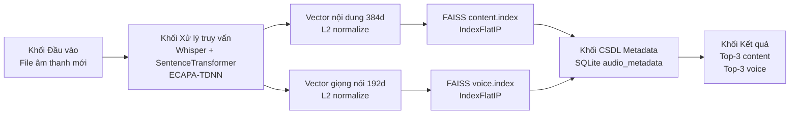

# Tài liệu 3a - Quy trình thực hiện Giai đoạn 3 theo sơ đồ khối

**Mục lục & luồng chạy toàn đồ án:** `docs/README.md`.

## Mục tiêu

Xây dựng hệ thống tìm kiếm file âm thanh với kiến trúc CSDL lai:
- SQLite (hoặc MySQL nếu cần triển khai server) để lưu metadata và ánh xạ `file_id`.
- FAISS để lưu và truy vấn vector đặc trưng nội dung/giọng nói.

Đầu vào là file âm thanh mới. Đầu ra gồm 2 danh sách top-3:
- Top-3 giống nhất về nội dung.
- Top-3 giống nhất về giọng nói.

## Sơ đồ khối luồng đi



## Quy trình thực hiện chi tiết

1. Chuẩn bị đầu vào từ Giai đoạn 2:
   - File `stage2_features.jsonl` chứa transcript, keywords, content embedding, speaker embedding.

2. Khởi tạo CSDL metadata:
   - Tạo bảng `audio_metadata` gồm: `file_id`, `file_name`, `file_path`,
     `transcript_text`, `keywords`, `duration`, `content_faiss_id`, `voice_faiss_id`.

3. Khởi tạo hai FAISS index độc lập:
   - `content.index`: `IndexFlatIP`, dim = 384.
   - `voice.index`: `IndexFlatIP`, dim = 192.

4. Chuẩn hóa vector L2 trước khi add vào FAISS:
   - Với mọi vector `v`, dùng `v_hat = v / ||v||_2`.
   - Khi dùng `IndexFlatIP`, điểm inner product trên vector đã chuẩn hóa sẽ tương đương cosine similarity.

5. Đổ dữ liệu và ánh xạ ID:
   - Add vector nội dung và giọng nói vào 2 index.
   - Lấy `content_faiss_id`, `voice_faiss_id` theo thứ tự add.
   - Ghi metadata + 2 FAISS ID vào bảng `audio_metadata`.

6. Truy vấn top-3:
   - Trích xuất vector truy vấn từ file âm thanh mới.
   - L2 normalize vector truy vấn.
   - Search top-k trên 2 index FAISS.
   - Map `faiss_id` về metadata qua bảng SQLite.
   - Trả kết quả theo thứ tự similarity giảm dần.

## Thuật toán so khớp độ tương đồng nội dung (Top 3)

**Đầu vào:** file âm thanh truy vấn \(q\); kho đã index với vector nội dung \(\{\hat{x}_i\}_{i=1}^N\) (384 chiều, đã chuẩn hóa L2 trong FAISS).

**Bước 1 — Trích vector truy vấn:** Whisper → văn bản \(t_q\) → SentenceTransformer → \(v_q \in \mathbb{R}^{384}\).

**Bước 2 — Chuẩn hóa:** \(\hat{q} = v_q / \|v_q\|_2\) (trong triển khai: `faiss.normalize_L2`).

**Bước 3 — Đo độ tương đồng:** Với mỗi \(\hat{x}_i\) trong kho (đã L2), \(\mathrm{sim}_i = \hat{q}^\top \hat{x}_i\) (inner product = cosine similarity).

**Bước 4 — Top-3:** Sắp xếp \(\mathrm{sim}_i\) giảm dần, lấy 3 chỉ số \(i\) cao nhất; tra SQLite theo `content_faiss_id` để lấy đường dẫn/tên file.

**Đầu ra:** danh sách 3 file kèm điểm \(\mathrm{sim}\) giảm dần.

## Thuật toán so khớp độ tương đồng giọng nói (Top 3)

**Đầu vào:** \(q\); kho \(\{\hat{y}_j\}_{j=1}^N\) (192 chiều ECAPA-TDNN, L2 trong FAISS).

**Bước 1:** ECAPA-TDNN → \(u_q \in \mathbb{R}^{192}\).

**Bước 2:** \(\hat{q}_v = u_q / \|u_q\|_2\) (`faiss.normalize_L2`).

**Bước 3:** \(\mathrm{sim}_j = \hat{q}_v^\top \hat{y}_j\) (cosine qua inner product).

**Bước 4:** Top-3 theo \(\mathrm{sim}_j\) giảm dần; tra SQLite theo `voice_faiss_id`.

**Đầu ra:** 3 file có giọng gần nhất kèm điểm giảm dần.

## Lệnh chạy chính

```bash
python src/stage3/database_builder.py \
  --stage2-jsonl src/artifacts/stage2/stage2_features.jsonl \
  --sqlite-db src/artifacts/stage3/audio_hybrid.db \
  --content-index src/artifacts/stage3/content.index \
  --voice-index src/artifacts/stage3/voice.index
```
